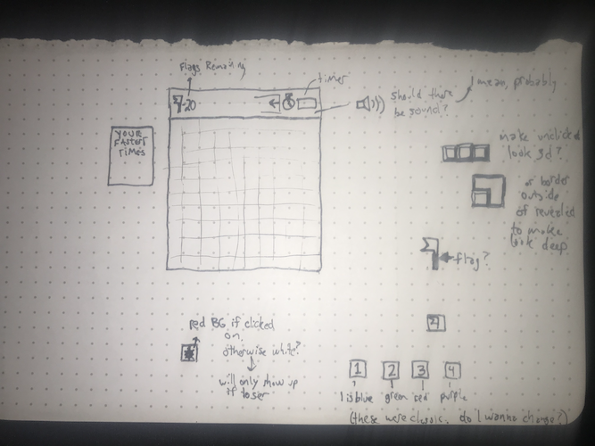
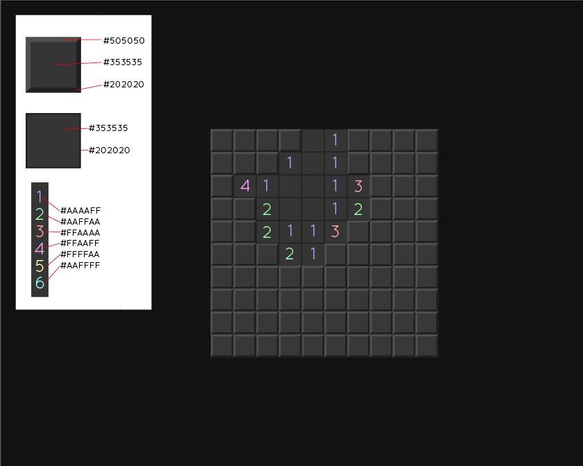

# minesweeper
 


```//Define required constants
    // Types of cells
        // Mine cell
        // Empty cell
        // Number cell
        // Flag cell
        // Hidden cell

//Define required variables used to track the state of the game
    // Difficulty Level
        // numOfMines - number
        // board (locations of mines) - array
            // - array of arrays of numbers to represent each cell's value
    // gameOver - boolean
    // isWinner - boolean
    // numOfFlags - number
    // timer
    // message - string
    // fastTimes - array of numbers

// Cached DOM elements
    // All of the cells on the board 
    // Replay button
    // Message


// Upon loading the app should:
    // Receive player input for difficulty level
    // Create the board accordinly
        // Initialize the board as an array of arrays of nums
            // Maybe a 1 dimensional array... I haven't decided yet
            // These nums represent the value at each cell
            // Initialize these to null
        // Randomize the mine locations (mines have a value or -1)
        // gameOver = false;
        // isWinner = false;
        // message  = 'Good Luck!' or something
    // Render those values to the page
    // Wait for the user to click a cell

// Handle if player clicks a cell
    // If this is the first cell they have clicked
        // Start the timer
    // If cell contains a mine
        // gameOver
    // Otherwise - If cell is touching at least one mine
        // Reveal the number of mines that cell is touching
    // Otherwise - If cell is touching no mines
        // Reveal all connected cells that are touching no mines
        // Reveal a border of numbers surrounding the blank cells
        // This part sounds hard. We shall see.
    // Make sure all revealed cells are unclickable

// Handle if player right clicks 
    // If cell is unflagged
        // Give cell a flag
        // Make that cell un-left-clickable
            // If cell has class of flagged, remove event listener? Probably...
        // Decrease remaining flags available by 1
    // If cell is flagged
        // Remove flag from cell
        // Make that cell left-clickable again 
        // Increase remaining flags available by 1

// If gameOver 
    // Stop timer
    // Reveal replay button
    // If winner
        // Winner message
        // If time is in top scores, save it to the top scores
    // If loser
        // Reveal remaning mines
        // Loser message
        
    // I think I want the overall opacity of the board to fade down to maybe 
    // 30-50% while the gameOver div shows up full opacity over top of it.
    // Along with the gameOver message, will be the replay button
    // When user presses the replay button, the div will ask the user 
    // for game difficulty. Upon selection, the board will render and 
    // fade back in to full opacity.
    

    // SHAMELESS SELF PROMOTION
    // Don't forget to come see my band tomorrow night