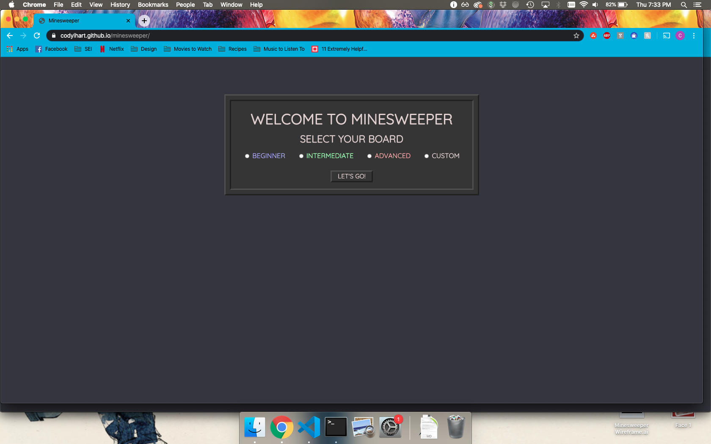
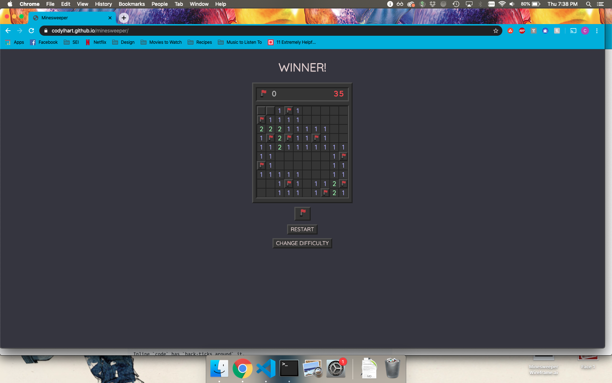
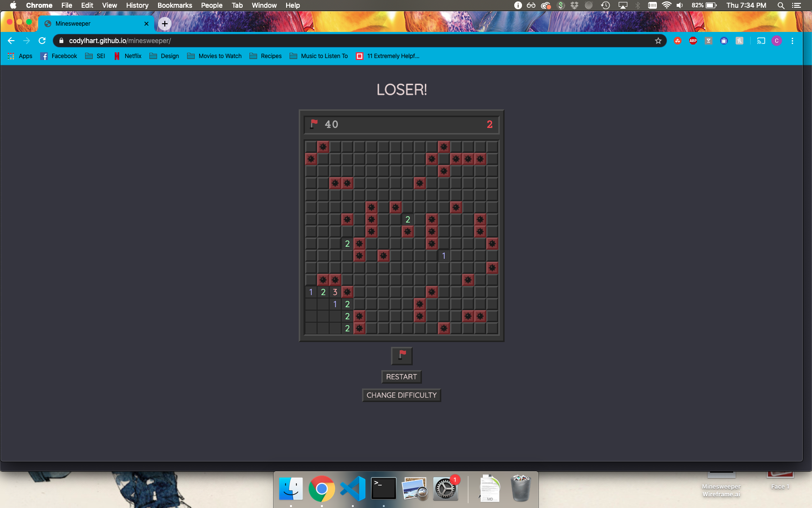
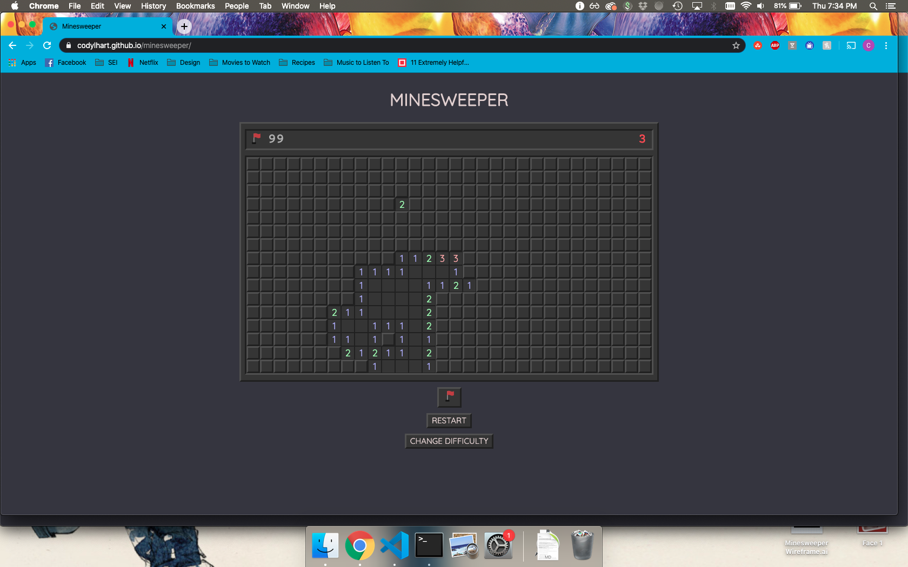

# MINESWEEPER

This is my version of the game, Minesweeper. Minesweeper is a classic video game with a board of randomly placed mines. The objective of the player is to successfully identify the location of each of the mines on the board without revealing any of the mines themselves. The player wins when either all non-mine cells are revealed or all mine cells are marked with flags. 

---

## TECHNOLOGIES USED
HTML, CSS, Javascript, Adobe Illustrator

---
## GETTING STARTED
[Play The Game Here!](https://codylhart.github.io/minesweeper/)

To begin, choose a level of difficulty (beginner, intermediate, advanced, or customize your own board size).
Once your board has been selected, click a square to reveal it. If the square is touching any mines, it will reveal the number of mines it is touching. If it is touching no mines, it will be revealed as blank along with all connected cells that are touching no mines. This field of blank spaces will be surrounded by a border of numbered cells that indicate how many mines they are each touching. To place a flag, either hold command or alt while you click on the cell, or click on the flag button to activate flag mode where you can click on any cell to place a flag.

---
## NEXT STEPS
The next steps to enhance the playing experience will be to allow for the player to change the stylistic appearance of the game (alternate colors scheme, classic mode, etc.). In addition, I would like to make it fit with some iterations of Minesweeper that make it so that the first click can never contain a mine. Additionally, I would like to work on some responsive design to clean up the game for mobile use.